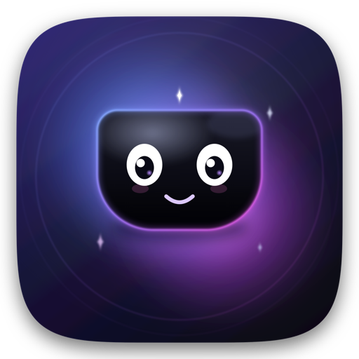
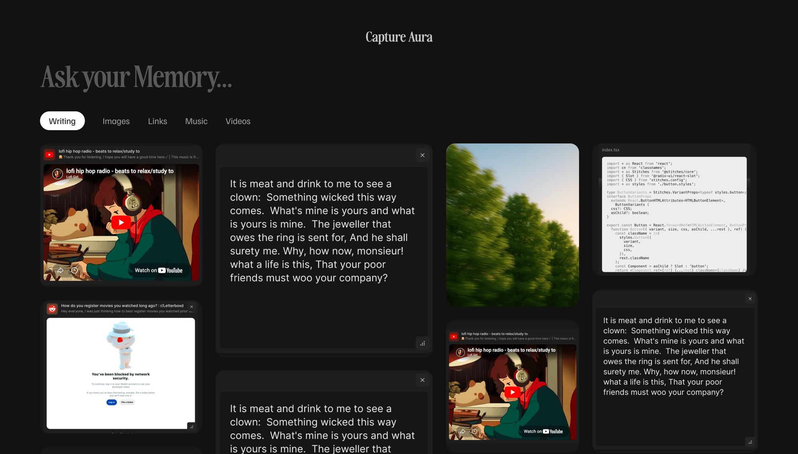
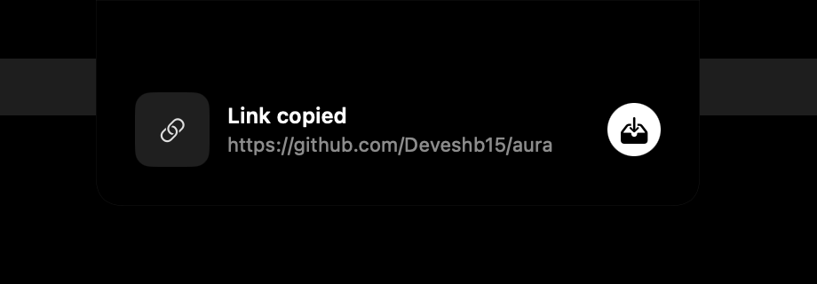
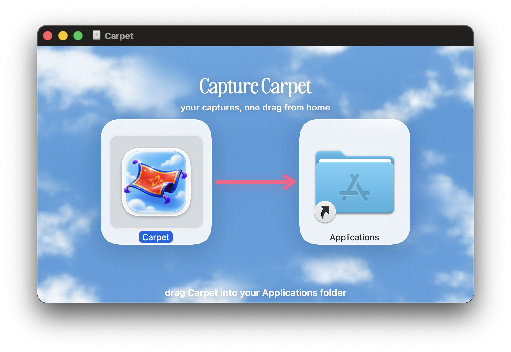

<div align="center">



# Aura

**Copy anything. It lands in your notch. Find it forever.**

A tiny menu-bar app that turns your Mac's notch into a capture vault. Copy or drag in a
link, a paragraph, an image, a file, a color — Aura quietly catches it with a soft nudge,
and it all lands in a beautiful, searchable library. 100% local. ✨

[**↓ Download for macOS**](https://github.com/Deveshb15/aura/releases/latest) &nbsp;·&nbsp; macOS 14+ &nbsp;·&nbsp; Apple Silicon &amp; Intel

<br/>



</div>

<br/>

## What it is

Aura lives in your Mac's notch (or a small pill, if your Mac has no notch). Copy
something — a link, a snippet, an image, a hex color — and the notch gives a soft
rubber-band **nudge**. Hover to keep it; ignore it and it slips away. You can also
drag files and links straight onto the notch, and drag saved items back out.

Everything you keep lands in the **library**: a dark, serif bento grid you can search
(*"Ask your Memory…"*) and filter by type. It's a calm little home for the things you'd
otherwise lose in a sea of tabs and screenshots — and it never leaves your Mac.

<br/>

## Catch it in the notch

<div align="center">

</div>

Copy or drag something in, and the notch nudges down like stretched rubber. A little chip
offers to **keep** it — so nothing is saved unless you say so. Password-manager and
transient clipboard content is ignored automatically. Press **⌥⌘V** anytime to summon the
library from anywhere.

<br/>

## Ask your Memory

Search is the heart of Aura, and it's **semantic** — it reads what you actually saved, not
just titles. Text in your screenshots (OCR), the readable body of the articles behind your
links, video titles and descriptions — each item is turned into an embedding with Apple's
on-device **NaturalLanguage** models, and your library is ranked by *meaning*. So
*"that documentary about money"* or *"everything I saved about investing"* surfaces the right
things even when the exact words don't match.

On Macs with Apple Intelligence (**macOS 26+, Apple Silicon**), pressing **return** also
streams a short written **answer** above the results — grounded in the items it found, and
generated entirely on-device by Apple's **Foundation Models**. Older or Intel Macs get the
same semantic-ranked grid, just without the written answer. Either way, nothing leaves your Mac.

<br/>

## Install

<table>
<tr>
<td width="46%" valign="middle">

</td>
<td width="54%" valign="top">

1. Download **`Aura.dmg`** from [**Releases**](https://github.com/Deveshb15/aura/releases/latest).
2. Open it and drag **Aura** into your **Applications** folder.
3. Launch it — Aura lives in the **menu bar / notch** (no Dock icon).

Signed with a Developer ID and **notarized by Apple**, so it opens with no Gatekeeper
warnings. Requires **macOS 14** or later.

</td>
</tr>
</table>

<br/>

## How it works (and your privacy)

- **Capture** watches the clipboard a few times a second (and backs off on battery). Nothing
  is saved until you keep it; password-manager / transient clipboard content
  (`org.nspasteboard.ConcealedType` / `TransientType`) is skipped.
- **One store, two surfaces.** A single reactive `DataStore` (GRDB / SQLite, with FTS5 search)
  backs both the notch and the library — keep something in the notch and it appears in the
  library instantly.
- **Originals** live on disk under `~/Library/Application Support/Aura/`; only small thumbnails
  are cached inline for a fast grid.
- **Retrieval needs no special permissions** — click an item to copy it back, or drag it out to
  any app. No paste-injection, so no Accessibility prompt.
- **Search is fully local.** OCR (Vision), embeddings (NaturalLanguage), and the written
  answer (Foundation Models) all run **on-device** — your captures are never sent anywhere.
- **It stays on your Mac.** No analytics, no account, no sync. The only network calls fetch
  link previews and the readable text of the pages you save, so links are searchable by their
  content (toggle off in Settings). Delete the Application Support folder to reset everything.

<br/>

## Build from source

Requires macOS 14+, Xcode 16+, and [XcodeGen](https://github.com/yonaskolb/XcodeGen)
(`brew install xcodegen`).

```sh
xcodegen generate          # regenerate Aura.xcodeproj from project.yml
xcodebuild -project Aura.xcodeproj -scheme Aura -configuration Debug build
```

Or `open Aura.xcodeproj` and hit ⌘R. The only dependency is GRDB (via SwiftPM), and the
"Awesome Serif" display face is bundled under `Aura/Fonts/`.

A signed + notarized release DMG (with the dark "drag to Applications" art, rendered by
`Tools/DMGBackground.swift`) is one command:

```sh
NOTARY_PROFILE=<your-notarytool-profile> ./scripts/release.sh
```

<br/>

## Project layout

```
project.yml                  XcodeGen spec (source of truth; .xcodeproj is generated)
Tools/                       DMGBackground.swift (reproducible disk-image art)
scripts/release.sh           build → Developer ID sign → notarize → staple → DMG
Aura/
  App/                       @main app, AppDelegate, MenuBarContent, GlobalHotKey, FontRegistrar
  Capture/                   ClipboardWatcher, PasteboardReader, DropReceiver, CaptureCandidate
  Notch/                     NotchController + panel, hover state machine, rubber-band nudge
  Library/                   LibraryWindowView, ContentTypeTabBar, BentoGridView, CardView, Cards/, AuraTheme
  Storage/                   AppDatabase (schema), DataStore, Item, AssetStore, ThumbnailService
  Search/                    EmbeddingService, SemanticIndex, HybridSearch, OCRService, ArticleExtractor, AnswerService
  Settings/                  SettingsView
  Shared/                    URLClassifier, ColorDetector, LinkMetadataService, Color+Hex
  Fonts/                     Awesome Serif
  Assets.xcassets            AppIcon
```

<br/>

## License

[MIT](LICENSE) © 2026 Devesh Bhimanpelli. Free to use, modify, and share — just keep the copyright notice.

<br/>

<div align="center">
A calm home for everything you capture. 🪶
</div>
